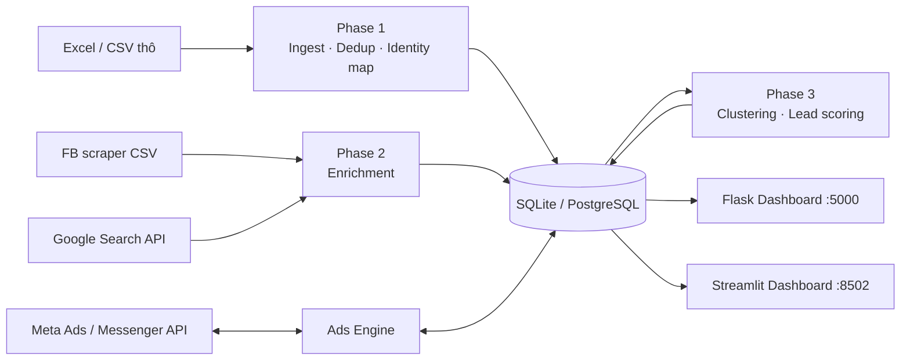

# 🏠 BDS Data Pipeline – BigData Lead Platform

Hệ thống **xử lý, làm giàu và chấm điểm khách hàng Bất động sản bằng AI**, kèm **Ads Engine** để phân tích và tối ưu quảng cáo Facebook.

Gom hàng nghìn file Excel/CSV khách hàng rời rạc → chuẩn hoá & khử trùng lặp → hợp nhất danh tính (SĐT ↔ Facebook UID) → phân cụm & chấm điểm lead (0–10) → hiển thị trên dashboard để đội Sales ưu tiên chăm sóc.

> [!IMPORTANT]
> Repo này **chỉ chứa mã nguồn**. Không có dữ liệu khách hàng nào được đưa lên. Thư mục `data/` và mọi file `*.xlsx`, `*.csv`, `*.db` đều bị chặn bởi `.gitignore`.

---

## ✨ Tính năng chính

| Giai đoạn | Mô tả | Module |
|---|---|---|
| **Phase 1 – Data Pipeline** | Đọc hàng loạt Excel/CSV (tự nhận encoding), chuẩn hoá SĐT/tên, khử trùng lặp, map SĐT ↔ Facebook UID, phân khúc audience | `src/phase1_pipeline/` |
| **Phase 2 – Enrichment** | Import dữ liệu từ tool scraping Facebook, tìm kiếm Google Custom Search, lọc & ghép hồ sơ | `src/phase2_enrichment/` |
| **Phase 3 – AI Scoring** | Phân cụm khách hàng (scikit-learn), chấm điểm lead 0–10, xếp hạng VIP | `src/phase3_scoring/` |
| **Analytics** | Mô hình RFM, unified scorer, phân tích ý định (intent) | `src/analytics/`, `src/intent_analyzer.py` |
| **Ads Engine** | Kết nối Facebook Marketing API & Messenger API, phân tích chi phí (CPL/CPM/CTR), chấm chất lượng lead, đề xuất & tự động tối ưu chiến dịch (có chế độ dry-run/mock) | `src/ads_engine/` |
| **Dashboard** | Flask (Ads, CRM Leads, Multi-Account) và Streamlit (Data Health, 360° Profile, AI Clusters) | `dashboard/`, `src/dashboard/` |

## 🧭 Kiến trúc



## 📁 Cấu trúc thư mục

```
├── main.py                 # CLI chạy pipeline (Phase 1/2/3)
├── start.py / start.bat    # Launcher mở dashboard
├── ecosystem.config.js     # Cấu hình PM2 (chạy nền)
├── check_db.py             # Kiểm tra nhanh database
├── dashboard/              # Flask dashboard + templates HTML
├── src/
│   ├── phase1_pipeline/    # Ingest, identity mapping, segmentation
│   ├── phase2_enrichment/  # FB/Google enrichment, matcher
│   ├── phase3_scoring/     # Clustering, lead scorer
│   ├── analytics/          # RFM, unified scorer
│   ├── ads_engine/         # Facebook Ads + Messenger, optimizer
│   ├── dashboard/          # Streamlit dashboard
│   ├── utils/              # File auditor, classifier
│   └── database.py         # Lớp truy cập DB (SQLAlchemy)
├── tests/                  # Pytest + script sinh dữ liệu mẫu
└── data/                   # (trống – dữ liệu local, không commit)
```

## 🚀 Cài đặt

**Yêu cầu:** Python 3.10+

```bash
git clone https://github.com/leozuki/bigdata-platform.git
cd bigdata-platform

python -m venv .venv
# Windows
.venv\Scripts\activate
# macOS / Linux
source .venv/bin/activate

pip install -r requirements.txt
pip install streamlit        # nếu dùng dashboard Streamlit

cp .env.example .env         # Windows: copy .env.example .env
```

Sau đó mở `.env` và điền các giá trị cần thiết (xem mục **Cấu hình**).

## ⚙️ Cấu hình (`.env`)

| Biến | Ý nghĩa |
|---|---|
| `DATABASE_URL` | Mặc định SQLite; hỗ trợ PostgreSQL |
| `RAW_DATA_DIR`, `PROCESSED_DATA_DIR` | Thư mục chứa dữ liệu thô / đã xử lý |
| `GOOGLE_API_KEY`, `GOOGLE_CSE_ID` | Google Custom Search (Phase 2) |
| `META_APP_ID`, `META_APP_SECRET`, `META_ACCESS_TOKEN`, `META_AD_ACCOUNT_ID`, `META_PAGE_ID` | Facebook Marketing & Messenger API |
| `ADS_DRY_RUN` | `true` = chỉ xem trước hành động, **không** thay đổi quảng cáo thật |
| `ADS_MOCK_MODE` | `true` = dùng dữ liệu giả, không cần API key |
| `RULE_*`, `BENCH_*` | Ngưỡng tối ưu & benchmark chi phí (VND) |

> [!WARNING]
> Không bao giờ commit file `.env`. Nên để `ADS_DRY_RUN=true` cho tới khi đã kiểm tra kỹ các đề xuất của optimizer.

## ▶️ Sử dụng

### Chạy pipeline

```bash
python main.py --phase all                       # Chạy cả 3 giai đoạn
python main.py --phase 1 --raw-dir D:/MyData     # Chỉ ingest từ thư mục chỉ định
python main.py --phase 2 --fb-csv fb_export.csv  # Enrichment từ file FB scraper
python main.py --phase 3                         # Chỉ phân cụm + chấm điểm
```

| Tham số | Mô tả |
|---|---|
| `--phase` | `1` \| `2` \| `3` \| `all` |
| `--raw-dir` | Thư mục chứa Excel/CSV thô |
| `--fb-csv` | File CSV export từ tool scraping Facebook |
| `--uid-mapping` | File CSV map SĐT → Facebook UID |
| `--google-queries` | Danh sách query, phân cách bằng `\|` |

### Mở dashboard

```bash
python start.py              # Flask       → http://localhost:5000
python start.py --streamlit  # Streamlit   → http://localhost:8502
python start.py --both       # Chạy cả hai
python start.py --pipeline   # Chạy Phase 1 rồi mở Flask
```

Trên Windows có thể nhấp đúp `start.bat`. Để chạy nền bằng PM2: `pm2 start ecosystem.config.js`.

### Dùng thử không cần dữ liệu thật

```bash
python tests/generate_sample_data.py   # Sinh dữ liệu mẫu giả lập
pytest tests/
```

## 🔒 Bảo mật & sử dụng có trách nhiệm

- Hệ thống xử lý **dữ liệu cá nhân** (SĐT, tên, hồ sơ mạng xã hội). Chỉ sử dụng với dữ liệu bạn có quyền hợp pháp thu thập và xử lý, tuân thủ **Nghị định 13/2023/NĐ-CP** về bảo vệ dữ liệu cá nhân và điều khoản của Meta/Google.
- Giữ toàn bộ dữ liệu trong `data/` (đã được `.gitignore` chặn); không đưa dữ liệu khách hàng lên repo công khai.
- Lưu API key/token trong `.env`, không viết thẳng vào code.

## 🛠️ Công nghệ

Python · pandas · Dask · scikit-learn · SQLAlchemy · Flask · Streamlit · facebook-business SDK · APScheduler · BeautifulSoup · pytest
